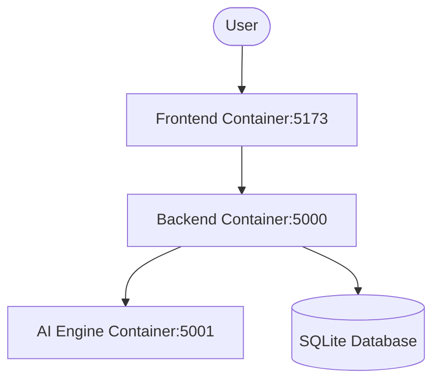

# 🏗️ System Architecture

## Overview

The AI-Driven Attendance System is built using a **three-tier architecture**:

1. **Frontend (React)** - User interface
2. **Backend API (Node.js)** - Business logic and data management
3. **AI Engine (Python)** - Face recognition processing

```
┌─────────────────────────────────────────────────────────────┐
│                         Frontend                             │
│                  (React + Vite in Docker)                    │
│                  http://localhost:5173                       │
└────────────────────────┬────────────────────────────────────┘
                         │ REST API
                         ▼
┌─────────────────────────────────────────────────────────────┐
│                      Backend API                             │
│               (Node.js + Express in Docker)                  │
│                  http://localhost:5000                       │
│                                                              │
│  ┌──────────────┐  ┌──────────────┐  ┌──────────────┐      │
│  │   Routes     │  │ Controllers  │  │  Database    │      │
│  │              │  │              │  │  (SQLite)    │      │
│  └──────────────┘  └──────────────┘  └──────────────┘      │
└────────────────────────┬────────────────────────────────────┘
                         │ HTTP Requests
                         ▼
┌─────────────────────────────────────────────────────────────┐
│                       AI Engine                              │
│                (Python + Flask in Docker)                    │
│                  http://localhost:5001                       │
│                                                              │
│  ┌──────────────────────────────────────────────────┐       │
│  │  Face Detection → Embedding → Recognition        │       │
│  │  (OpenCV + face_recognition library)             │       │
│  └──────────────────────────────────────────────────┘       │
└─────────────────────────────────────────────────────────────┘
```

## Technology Stack

### Frontend
- **Framework**: React 18
- **Build Tool**: Vite
- **Routing**: React Router v6
- **HTTP Client**: Axios
- **Icons**: Lucide React
- **Styling**: Custom CSS with design system

### Backend
- **Runtime**: Node.js v22.20.0
- **Framework**: Express.js
- **Database**: SQLite (better-sqlite3)
- **Authentication**: JWT (jsonwebtoken)
- **File Upload**: Multer
- **Password Hashing**: bcryptjs
- **Validation**: express-validator

### AI Engine
- **Language**: Python 3.14.2
- **Web Framework**: Flask
- **Face Detection**: OpenCV
- **Face Recognition**: face_recognition (dlib)
- **Image Processing**: Pillow, NumPy

## Data Flow

### 1. Student Registration

```
Teacher → Frontend → Backend API → AI Engine
                         ↓              ↓
                    Save to DB    Generate Embedding
                                       ↓
                                  Save Embedding
```

### 2. Attendance Processing

```
Teacher captures photo → Frontend uploads
                              ↓
                         Backend API
                              ↓
                    Create session record
                              ↓
                         AI Engine
                              ↓
                    Detect faces in image
                              ↓
                    Generate embeddings
                              ↓
                    Compare with stored embeddings
                              ↓
                    Return recognized students
                              ↓
                         Backend API
                              ↓
                    Save attendance records
                              ↓
                         Frontend
                              ↓
                    Display results
```

## Database Schema

### users
- id (PRIMARY KEY)
- username (UNIQUE)
- email (UNIQUE)
- password (hashed)
- role (admin/teacher/student)
- full_name
- created_at
- updated_at

### students
- id (PRIMARY KEY)
- user_id (FOREIGN KEY → users.id)
- roll_number (UNIQUE)
- class
- section
- department
- photo_path
- embedding_path
- created_at
- updated_at

### attendance_sessions
- id (PRIMARY KEY)
- teacher_id (FOREIGN KEY → users.id)
- class
- section
- subject
- session_date
- session_time
- image_path
- total_students
- present_count
- unknown_count
- status (pending/approved/rejected)
- created_at
- updated_at

### attendance_records
- id (PRIMARY KEY)
- session_id (FOREIGN KEY → attendance_sessions.id)
- student_id (FOREIGN KEY → students.id)
- status (present/absent/unknown)
- confidence
- manually_marked
- created_at
- updated_at

### unknown_faces
- id (PRIMARY KEY)
- session_id (FOREIGN KEY → attendance_sessions.id)
- face_image_path
- embedding_path
- reviewed
- matched_student_id (FOREIGN KEY → students.id)
- created_at

## API Endpoints

### Authentication
- `POST /api/auth/register` - Register new user
- `POST /api/auth/login` - User login
- `GET /api/auth/me` - Get current user
- `PUT /api/auth/password` - Update password

### Students
- `GET /api/students` - Get all students (with filters)
- `GET /api/students/:id` - Get student by ID
- `POST /api/students` - Add new student
- `PUT /api/students/:id` - Update student
- `DELETE /api/students/:id` - Delete student
- `GET /api/students/meta/classes` - Get all classes
- `GET /api/students/meta/sections/:class` - Get sections for class

### Attendance
- `POST /api/attendance/session` - Create attendance session
- `GET /api/attendance/sessions` - Get all sessions
- `GET /api/attendance/sessions/:id` - Get session details
- `PUT /api/attendance/records/:id` - Update attendance record
- `PUT /api/attendance/sessions/:id/approve` - Approve session
- `DELETE /api/attendance/sessions/:id` - Delete session

### Analytics
- `GET /api/analytics/student/:id` - Student statistics
- `GET /api/analytics/class/:className` - Class statistics
- `GET /api/analytics/subject/:subject` - Subject statistics
- `GET /api/analytics/dashboard` - Dashboard overview
- `GET /api/analytics/export/csv` - Export CSV report

### AI Engine
- `GET /health` - Health check
- `POST /generate-embedding` - Generate face embedding
- `POST /recognize-faces` - Recognize faces in image
- `POST /update-threshold` - Update confidence threshold

## Security Features

1. **JWT Authentication**: Secure token-based authentication
2. **Password Hashing**: bcrypt with salt rounds
3. **Role-Based Access Control**: Admin, Teacher, Student roles
4. **Input Validation**: express-validator for API inputs
5. **File Upload Validation**: Size and type restrictions
6. **SQL Injection Prevention**: Prepared statements
7. **CORS Configuration**: Controlled cross-origin requests

## Face Recognition Algorithm

### Process Flow

1. **Face Detection**
   - Uses HOG (Histogram of Oriented Gradients) algorithm
   - Detects face locations in image
   - Returns bounding boxes

2. **Face Encoding**
   - Generates 128-dimensional face embedding
   - Uses deep learning model (dlib)
   - Embedding represents unique facial features

3. **Face Recognition**
   - Compares detected face embeddings with stored embeddings
   - Calculates Euclidean distance
   - Confidence = 1 - distance
   - Threshold: 0.6 (configurable)

### Accuracy Factors

- **Photo Quality**: Higher resolution = better accuracy
- **Lighting**: Consistent lighting improves recognition
- **Face Angle**: Front-facing photos work best
- **Face Size**: Minimum 50x50 pixels recommended
- **Database Size**: More training data = better accuracy

## Scalability Considerations

### Current Limitations
- SQLite: Good for small to medium deployments (< 1000 students)
- Single-threaded AI processing
- Local file storage

### Scaling Options

1. **Database**: Migrate to PostgreSQL/MySQL for larger deployments
2. **AI Processing**: 
   - Use GPU acceleration (CUDA)
   - Implement queue system (Redis + Bull)
   - Horizontal scaling with multiple AI workers
3. **File Storage**: Move to cloud storage (S3, Azure Blob)
4. **Caching**: Implement Redis for frequently accessed data
5. **Load Balancing**: Use Nginx for multiple backend instances

## Deployment Architecture (Dockerized)

The entire system is containerized using Docker, ensuring that the complex AI dependencies (dlib, face_recognition) and Node.js environment are consistent across all platforms.



### CI/CD Workflow
We use **GitHub Actions** to maintain code quality:
1. **CI Check**: Verifies dependency installation and syntax.
2. **Docker Build Check**: Ensures the container images build successfully on every push.

## Performance Optimization

1. **Frontend**
   - Code splitting
   - Lazy loading
   - Image optimization
   - Caching strategies

2. **Backend**
   - Database indexing
   - Query optimization
   - Connection pooling
   - Response compression

3. **AI Engine**
   - Batch processing
   - Model optimization
   - GPU utilization
   - Caching embeddings

## Monitoring & Logging

- **Backend**: Winston/Morgan for logging
- **AI Engine**: Python logging module
- **Metrics**: Track API response times, error rates
- **Alerts**: Set up for system failures, low accuracy

---

This architecture provides a solid foundation for a production-ready attendance system while remaining simple enough for educational institutions to deploy and maintain.
